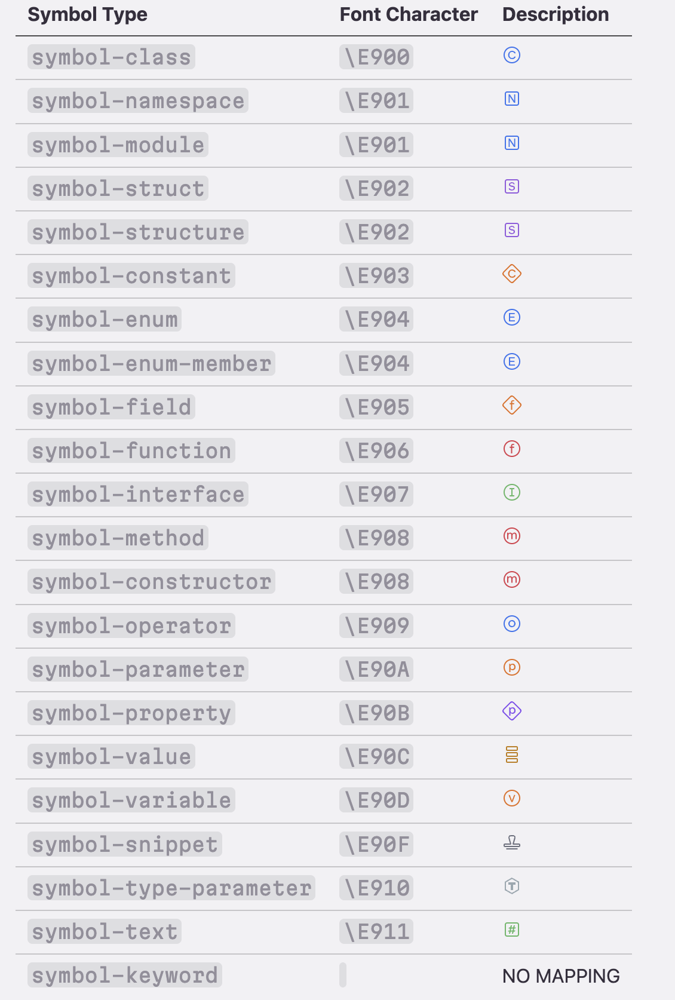

## How to add a new icon
> NOTE: I have changed the wrapper shape of `property` and `field` SVGs from circle to diamond.

1. Original SVG files are stored in `productions/svg_raw`

2. Edit each SVG file and save to `productions/svg_unfilled`. For each SVG file, removing all fill color:
- For rectangle-shaped icons, remove color fill: delete the `fill` attribute in `rect` elements
- For diamond-shaped icons, remove color fill: delete specific `path` elements
- For `type` symbol: delete specific `path` elements
- For `typeVariable` symbol: delete the `fill` attribute in `path` elements
- For `template` symbol: no processing needed

3. Convert stroke to path (XML tag), diamond-shaped icons don't need this operation:
- Inkscape: [inkscape command line, where is it on mac?](https://stackoverflow.com/questions/22085168/inkscape-command-line-where-is-it-on-mac)
- cd `productions/svg_unfilled`, run `sh stroke2path.sh`

4. Upload all the SVG in `productions/svg_unfilled/out` to IcoMoon or Fontello, remove color,  and finally generate icon font(`xxx.woff`).

## Resources
[Official Jetbrains icons SVG](https://jetbrains.design/intellij/resources/icons_list/)

[Vscode product icon theme extension guide](https://code.visualstudio.com/api/extension-guides/product-icon-theme)

[Vscode icon reference](https://code.visualstudio.com/api/references/icons-in-labels#icon-listing)

[Edit and preview SVG online](https://www.runoob.com/try/try.php?filename=trysvg_stroke0)

[iconfont-preview extension](https://marketplace.visualstudio.com/items?itemName=stxr.iconfont-preview)
